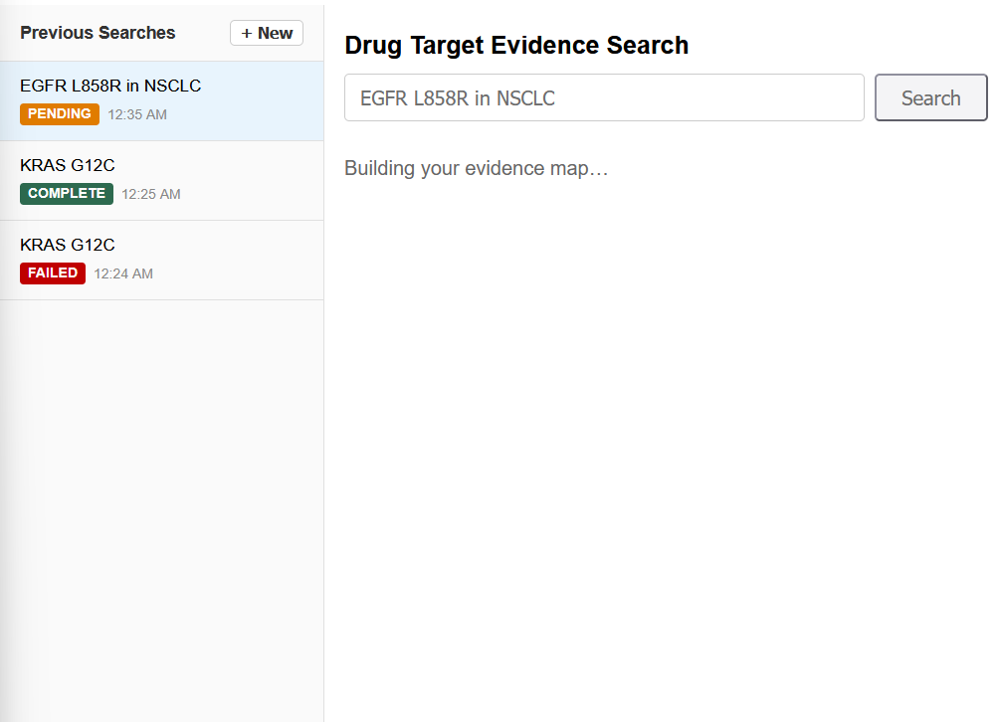
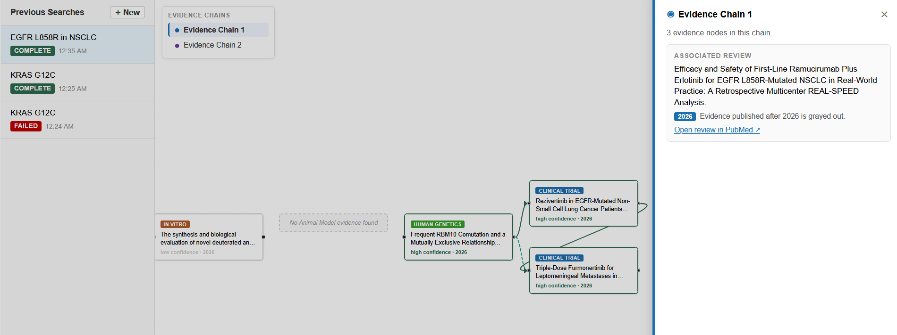
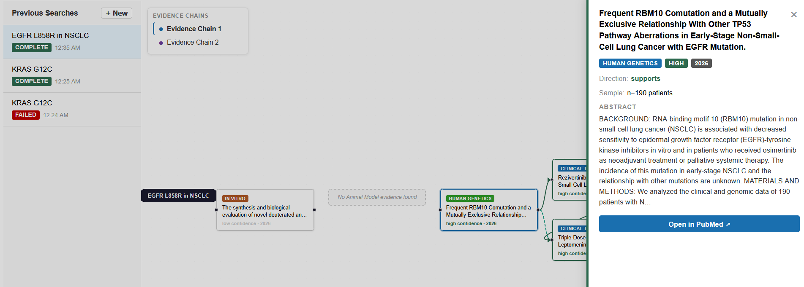
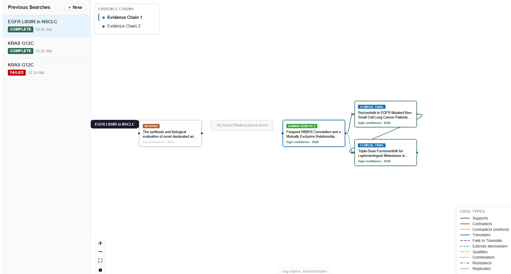

# MATA — Drug Target Evidence Aggregator

MATA helps biopharma researchers assess the evidence chain for a drug target. Enter a target (e.g. "KRAS G12C") and MATA fetches PubMed abstracts, classifies each by study type and effect direction using an LLM, then renders the evidence as an interactive graph — showing where the evidence chain is strong, where it's weak, and where evidence is absent.

**Live app:** [mata-devajyas-projects.vercel.app](https://mata-devajyas-projects.vercel.app)

---

## Current State and Active Constraints

The deployed version runs on CPU-only infrastructure (Render free tier). This has two direct consequences: paper count per query is capped at 5 to keep job completion time reasonable, and total job latency is higher than it should be. At 5 papers the pipeline is usable; at 10 it becomes slow enough to hurt the experience.

The first time this became a hard constraint was when edge classification was added (Chain Links milestone). Edge computation requires a second LLM call that sees all papers together — on CPU with Groq rate limits, this added enough latency that reducing the paper cap from 10 to 5 was the only practical fix. It exposed that the current architecture processes papers sequentially in a single worker, which doesn't scale.

The next round of infrastructure work is focused on three things:

- **Per-paper worker model** — split the extraction pipeline so each paper is processed by its own worker task, enabling true parallelism rather than sequential processing in a single job
- **GPU inference** — move LLM calls off Groq's free tier to a GPU-backed endpoint so extraction speed stops being the bottleneck
- **Multi-tenancy and caching** — job results are currently ephemeral per-session; the next step is persistent storage per user with a caching layer so repeated queries on the same target don't re-run the full pipeline

---

## How it works

```
  User enters target query
        │
        ▼
  POST /jobs  (FastAPI)              — creates job, returns job_id immediately (202)
        │
        ▼
  ARQ background worker              — picks up job from Redis
        │
        ├── pubmed.py               — NCBI Entrez esearch + efetch (async httpx)
        │     └── extracts: title, abstract, PMID, publication year
        │
        ├── llm.py  (Groq or Ollama) — structured JSON extraction, per abstract
        │     └── 11 fields: evidence_type, effect_direction, mechanism,
        │                    intervention, comparator, model_organism,
        │                    outcome_measure, population, time_horizon,
        │                    limitations, key_finding
        │
        ├── confidence.py           — scores each paper by study design (not LLM)
        │     └── clinical trial → 1.0, human genetics → 0.9,
        │         animal model → 0.5, in vitro → 0.2, review → 0.1
        │
        ├── graph.py                — rule-based layer assignment
        │     └── in vitro=0, animal=1, human genetics=2, clinical=3, review=−1
        │
        └── edges.py               — LLM batch call classifies pairwise relationships
              └── 10 edge types: supports, contradicts, translates,
                  fails_to_translate, mechanistically_extends, qualifies, …
        │
        ▼
  SQLite (WAL mode)                  — job + result_json persisted on completion
        │
        ▼
  GET /job/{id}  polled every 3 s   — returns full result when status = complete
        │
        ▼
  React Flow graph                  — nodes by layer, edges by relationship type,
                                      chains by connected component (BFS)
```

---

## Evidence Layers

| Layer | Study types |
|-------|-------------|
| In Vitro | Cell / biochemical studies |
| Animal Model | Rodent and other preclinical models |
| Human Genetics | GWAS, genetic association studies |
| Clinical Trial | Phase I/II/III trials, clinical observations |

Review articles are fetched and used to set a "review year" for gray-out context, but are excluded from the layer graph — they don't count as primary evidence.

Gap nodes are rendered explicitly when a layer has no evidence. The absence of evidence is surfaced, not hidden.

---

## Architecture and Design Decisions

### Async job pipeline (why ARQ, not Celery)

The API returns a `job_id` immediately; the frontend polls `GET /job/{id}` every 3 seconds. This keeps the HTTP layer responsive regardless of how slow Groq or PubMed is.

ARQ was chosen over Celery because the entire pipeline is `async/await` (httpx for PubMed, asyncio for Groq). Celery requires a synchronous task function or extra wrappers; ARQ is async-native and integrates cleanly.

### Synchronous Groq client wrapped in `asyncio.to_thread()`

The code uses the synchronous `Groq` client, not `AsyncGroq`, wrapped in `asyncio.to_thread()`. The reason: `AsyncGroq` creates an `httpx.AsyncClient` at construction time which binds to the event loop. `pytest-asyncio` creates a new event loop per test function — so a module-level `AsyncGroq` instance would be on a stale loop from the second test onward, causing failures that only appear in CI. `asyncio.to_thread()` runs the sync client in a thread pool and is immune to this.

### Confidence scoring separated from LLM extraction

Confidence is not LLM-extracted — it's computed server-side by `ConfidenceEngine`. This separates two concerns that have different calibration needs: the LLM classifying what kind of evidence a paper presents, and the system deciding how much to trust that evidence type. The engine uses a pluggable factor pipeline (`SubjectTypeFactor` today); adding factors like recency or sample size requires no changes to the caller interface.

### Provider abstraction (Groq vs Ollama)

Both providers use identical system prompts and JSON response format. The code does not branch after `_raw_llm_call()` returns — the LLM output is the same shape regardless of which model produced it. Switching is done entirely through environment variables (`.env.local` sets `LLM_PROVIDER=ollama` and `GROQ_BASE_URL=localhost:11434`). This makes local development practical without burning API quota.

### Edge computation: three-stage pipeline

1. **`build_paper_contexts()`** — maps `EvidenceItem + StructuredEvidence` into lightweight `PaperContext` structs for comparison. No API calls.
2. **`is_comparable()`** — O(n²) rule-based pre-filter. Papers are only comparable if they share the same intervention or are in adjacent layers. This short-circuits the LLM call entirely when no comparable pairs exist.
3. **`classify_edges_via_llm()`** — a single LLM batch call for all comparable paper contexts. One call per job, not one per pair. This is a named module-level function so tests can monkeypatch it without touching the broader pipeline.

All exceptions in edge computation are caught at the `compute_all_edges()` boundary — the job still completes with its evidence nodes even if edge classification fails.

### Graph chain discovery (BFS in TypeScript)

Chains (connected components in the evidence graph) are discovered by BFS in `graphUtils.ts`. Each component becomes one `ChainMeta`. Chains are sorted: most nodes first, then highest max-layer. This puts the richest chain first so it's shown by default.

`graphUtils.ts` has no `@xyflow/react` imports. React Flow's generic types are applied only in `EvidenceGraph.tsx` at the canvas boundary. This keeps the graph assembly logic testable with Jest without canvas mocks.

### SQLite in WAL mode

The backend runs on a single Render instance. SQLite in WAL mode handles concurrent reads fine at this scale, and the job repository sits behind an interface so swapping to Postgres requires only `db/jobs.py`.

---

## Testing

The project has four layers of backend tests and one frontend layer:

| Command | What it runs | API access |
|---------|-------------|-----------|
| `make test` | 84 tests — unit, endpoint, job pipeline (all mocked) | None |
| `make test-local` | ~87 tests — adds 3 live worker tests via local Ollama + real PubMed | PubMed only |
| `make test-live` | ~9 tests — live worker tests against real Groq + PubMed | Groq + PubMed |
| `make test-e2e` | Smoke tests against deployed Render backend | Deployed service |
| `make frontend-test` | 15 Jest tests (all mocked, no canvas) | None |

`make test` is the default — deterministic, fast, no network access. The `@live` and `@e2e` markers let pytest select only the tests that need real APIs.

The 3 `@live` worker tests in `test-local` exercise the full job pipeline end-to-end: `run_search_job()` → real PubMed fetch → real Ollama LLM → SQLite persistence — without a running server or Redis, by calling the worker function directly.

---

## Getting Started

**Prerequisites:** Python 3.10+, Node.js 18+, Redis

**Setup:**
```bash
make install
cp backend/.env.example backend/.env
# Add GROQ_API_KEY and REDIS_URL to backend/.env
```

**Run with Groq (cloud LLM):**
```bash
make dev
# uvicorn + ARQ worker + Next.js all start together
# open http://localhost:3000
```

**Run with Ollama (local LLM, no API key required):**
```bash
# Requires: ollama serve with llama3.1:8b pulled
make dev-local
```

**Run tests:**
```bash
make test              # mocked, fast
make test-local        # live pipeline via Ollama
make frontend-test     # Jest
```

**Kill orphaned dev servers (WSL2 / port conflicts):**
```bash
make kill-dev          # frees :8000 and :3000
```

---

## Tech Stack

| Layer | Technology |
|-------|-----------|
| Backend | Python 3.10, FastAPI, ARQ, aiosqlite, Pydantic v2 |
| LLM | Groq (Llama 3.1 8B), Ollama (local dev) |
| Data source | NCBI Entrez / PubMed (async httpx) |
| Frontend | Next.js 14, React 18, TypeScript, React Flow (@xyflow/react) |
| Job queue | Redis (Upstash compatible) |
| Database | SQLite (WAL mode) |
| Deployment | Render (backend + worker), Vercel (frontend) |
| Testing | pytest, pytest-asyncio, Jest |

---

## Demonstration

**Search and async job pipeline** — query submitted, job history sidebar tracks pending/complete/failed states in real time.



**Evidence chain graph** — nodes positioned by layer (In Vitro → Human Genetics → Clinical Trial), gap node rendered for Animal Model, edges classified by relationship type. Chain panel shows the associated review and the gray-out year threshold.



**Node detail drawer** — clicking a node opens a slide-out panel with the full abstract, evidence type, effect direction, confidence tier, and a direct link to the PubMed source.



**Edge type legend** — 10 relationship types (Supports, Contradicts, Translates, Fails to Translate, etc.) each with a distinct colour and dash pattern, visible in the bottom-right corner.



---

## Next Steps

Milestones 0–3 are complete (walking skeleton → structured extraction → graph view → async job pipeline). The remaining planned milestones are:

**M4 — LLM Eval Harness** *(in progress)*
Make the extraction pipeline measurable. A hand-labelled dataset of 50 abstracts covering all evidence types drives a scoring harness (`eval.py`) that reports precision and recall per class and exits non-zero on regression. The skeleton and 20 labelled fixtures already exist; the goal is to reach 50 fixtures and a committed baseline score so prompt changes are trackable.

**M5 — Evidence Strength Summary**
A second LLM pass that receives the structured evidence graph (not raw abstracts) and produces a three-section plain-language summary: strongest evidence, key gaps, and the critical open question. Summaries reference specific node IDs so users can trace claims back to source. This is the feature that makes the output actionable for a non-expert audience.

**M6 — Export and Shareability**
PDF export of the graph + summary and a shareable URL that restores the full job result without re-running the pipeline. The job persistence from M3 makes the URL approach straightforward; the PDF is the harder part (layout of a variable-size graph into a printable document).

---

**Longer-term directions** (in rough priority order):

- **Contradiction surfacing** — render contradicting findings in a distinct lane, with an LLM-generated one-line explanation of why each conflict exists and an overall controversy score. The hard part is distinguishing genuine scientific contradiction from studies that are incomparable by design (different model organisms, different dosing regimes).
- **Cross-target comparison** — aligned multi-column graph view for 2–3 targets simultaneously, so portfolio decisions can be made visually. The layout problem is non-trivial: layers need to stay vertically aligned across chains with different node densities.
- **Temporal drift detection** — scheduled re-ingestion with a semantic diff between old and new graph states. Requires embedding-based deduplication to avoid flagging re-publications of the same findings as new evidence.
- **Internal document ingestion** — upload proprietary preclinical reports and have them appear as evidence nodes alongside public literature, with local-only LLM inference (Ollama) for anything that can't leave the company.

---

## Known Limitations

- Results are drawn from PubMed abstracts only — no full text, no internal documents
- Classification uses Llama 3.1 8B — expect occasional misclassifications on ambiguous or multi-intervention abstracts
- The backend runs on Render's free tier: first request after a period of inactivity may take 30–60 seconds while the server cold-starts
- Confidence scoring uses study design only — sample size, recency, and replication are not yet factored in
